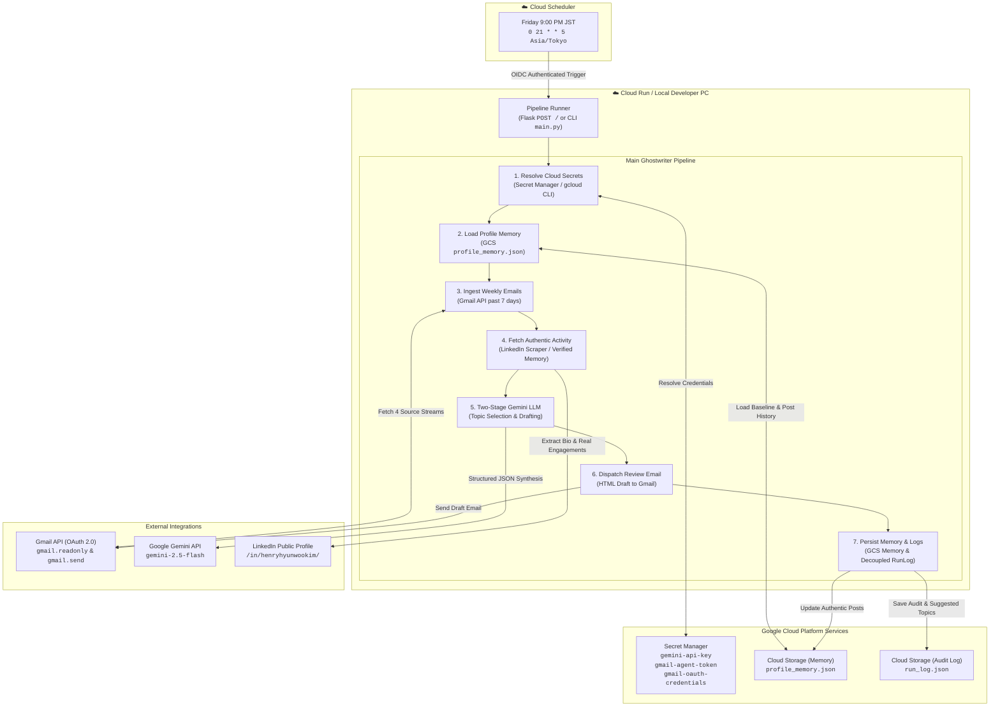

# LinkedIn Post Ghostwriter (Weekly Automated System)

An autonomous AI agent running on Google Cloud Run that executes every Friday at 9:00 PM JST. It ingests the past week's technical digests and email summaries from Gmail, retrieves the user's authentic LinkedIn profile and recent activity, and leverages Google Gemini to synthesize a concise, high-signal LinkedIn post. The draft is dispatched directly to Gmail for one-click review before publishing, while accumulating user profile memory and decoupled execution logs on Google Cloud Storage.

Designed with a **100% cloud-native, multi-PC portable architecture**: developers can clone and execute the system across any machine without copying local secret files or environment configurations.

---

## System Architecture



---

## Multi-PC Portability (Zero-Friction Cloud Configuration)

This repository is engineered to work seamlessly on any development machine without manually distributing `.env`, `credentials.json`, `token.json`, or local state files:

1. **GCP Secret Manager as Single Source of Truth**:
   - `gemini-api-key`: API key for Google Gemini generative models.
   - `gmail-agent-token`: OAuth 2.0 user access and refresh tokens for Gmail read/send scopes.
   - `gmail-oauth-credentials`: Desktop OAuth client credentials JSON (`client_id`, `client_secret`).
2. **Dual-Mode SDK & CLI Fallback**:
   - When running on Google Cloud Run, the application authenticates directly via Service Account Application Default Credentials (ADC).
   - When running locally on developer machines where ADC might be absent or expired, the system automatically falls back to invoking the active `gcloud` CLI session (`gcloud secrets versions access`) seamlessly across Windows, macOS, and Linux.
3. **On-Demand Local Token Cache**:
   - If an OAuth refresh is required locally, the client credentials JSON is automatically fetched into the OS temp directory (`tempfile.gettempdir()`), avoiding any uncommitted secret clutter in the workspace.
4. **Secret Synchronization Utility**:
   - Run `python -m src.sync_secrets` from any machine to upload or sync local credentials to Secret Manager in one step.

---

## State Persistence & Decoupled Run Logging (Google Cloud Storage)

System state is decoupled into two dedicated Google Cloud Storage blobs under `gs://$GCS_BUCKET_NAME/linkedin-ghostwriter/`:

### 1. `profile_memory.json` (Living Profile & Authentic LinkedIn Presence)
- **Baseline Profile**: Name, headline, professional summary, and core focus areas.
- **Authentic Post History**: Contains **only verified historical posts** published by the user on LinkedIn. AI-generated drafts are **never** committed here.
- **Recent Activities & Engagements**: Genuine reactions, comments, and shares scraped from LinkedIn to maintain contextual alignment with what the user has recently been engaging with.
- **Topic Blacklist**: Explicit list of excluded themes (unverified rumors, politics, generic platitudes).
- **Domain Insights**: Long-term accumulating themes and verified perspectives.

### 2. `run_log.json` (Decoupled Operational Audit & Suggested Topics)
- **Operational Runs**: Timestamped records of pipeline executions (status, duration, source message counts).
- **Suggested Topic History**: Rolling history of proposed draft topics and generated draft previews to prevent thematic repetition across consecutive weekly runs.

---

## Ingestion Sources & Gmail Search Queries

The pipeline queries Gmail across four distinct technical streams over a rolling lookback window (default: 7 days):

| Source | Origin / Stream | Gmail Filter Query | Extracted Content |
|---|---|---|---|
| **gmail-agent** | Internal Gmail summarizer | `("=== EMAIL SUMMARY ===" OR (from:me subject:Fwd:)) newer_than:7d` | Isolates `=== EMAIL SUMMARY ===` blocks, key discussion points, and action items |
| **AI News Digest** | `AI-news-aggregator-KRJP` | `subject:"Daily AI News Digest" newer_than:7d` | Regional East Asian AI policy, enterprise adoptions, and breakthrough announcements |
| **YouTube Digest** | `youtube-insight-digest` | `subject:"YouTube Intelligence Digest" newer_than:7d` | Technical video summaries, architectural teardowns, and engineering links |
| **ByteByteGo** | ByteByteGo Newsletter | `from:bytebytego@substack.com newer_than:7d` | System design, cloud scalability patterns, and distributed architecture insights |

---

## Post Format & Ghostwriting Guidelines

Every post drafted by the system adheres strictly to the following criteria:

1. **Language**: English only.
2. **Length & Density**: Concise thought (approx. 800–1,200 characters). Zero fluff, clickbait, or buzzword soup.
3. **Opening Hook**: A single high-conviction or curiosity-piquing line engaging technical leaders and engineers.
4. **Core Insight**: 2 to 3 crisp paragraphs connecting recent technical activities to broader implications (enterprise AI, cloud architecture, system design, or international digital transformation).
5. **Engagement Question**: 1 thoughtful closing question designed to spark genuine peer discussion in the comments.
6. **Sources Block**: Dedicated `Sources:` section at the bottom citing specific articles, newsletters, and digests referenced.
7. **Hashtags**: Exactly 3 to 5 targeted tags (e.g., `#ArtificialIntelligence`, `#CloudArchitecture`, `#SystemDesign`).

---

## Project Structure

```
linkedin-post-ghostwriter/
├── .env.example                 # Reference environment variables specification
├── .gcloudignore                # Google Cloud build exclusion rules
├── .gitignore                   # Git hygiene, local test & secret prevention
├── Dockerfile                   # Production Python 3.11 container image
├── requirements.txt             # Python dependencies
├── README.md                    # System documentation & architectural reference
├── deployment/
│   ├── deploy_cloud.ps1         # Cloud Run & Cloud Scheduler provisioning script
│   └── upload_token.ps1         # Secret Manager OAuth token sync script
└── src/
    ├── __init__.py              # Package marker
    ├── config.py                # Typed settings & dual-mode Secret Manager resolution
    ├── auth.py                  # Gmail OAuth 2.0 & multi-PC Secret Manager integration
    ├── gmail_reader.py          # 4-source weekly digest retrieval & parser
    ├── linkedin_scraper.py      # Authentic profile & activity scraper with cloud fallback
    ├── profile_memory.py        # Cloud Storage living profile memory manager
    ├── run_logger.py            # Decoupled GCS execution & suggested topic logger
    ├── post_drafter.py          # Gemini topic selector incorporating actual LinkedIn focus
    ├── email_sender.py          # HTML review email builder & Gmail dispatcher
    ├── sync_secrets.py          # Cloud Secret Manager synchronization utility
    ├── main.py                  # End-to-end pipeline orchestrator & CLI
    └── app.py                   # Flask serverless web endpoint (POST / & GET /)
```

> [!NOTE]
> In compliance with repository cleanliness standards, testing and debugging scripts are maintained externally and never committed to the project workspace.

---

## Configuration & Environment Variables

While all configuration falls back automatically to Google Cloud Secret Manager and Cloud Storage defaults, options can be overridden via environment variables or [.env.example](file:///.env.example):

| Variable | Secret Manager Name | Description | Default / Example |
|---|---|---|---|
| `GCP_PROJECT_ID` | — | Google Cloud project identifier | `gen-lang-client-0480639565` |
| `GCP_REGION` | — | Cloud Run and Storage region | `asia-northeast1` |
| `GCS_BUCKET_NAME` | — | Bucket for persistent memory & run logs | `gen-lang-client-0480639565-linkedin-memory` |
| `GEMINI_API_KEY` | `gemini-api-key` | Google Gemini API key | Resolved from Secret Manager |
| `GEMINI_MODEL` | — | Gemini generative model | `gemini-2.5-flash` |
| `RECIPIENT_EMAIL` | — | Target Gmail address for draft review | `henry.hyunwookim@gmail.com` |
| `RECIPIENT_NAME` | — | Display name for draft email header | `Henry` |
| `LINKEDIN_PROFILE_URL` | — | Target public profile URL | `https://www.linkedin.com/in/henryhyunwookim/` |
| `LINKEDIN_LI_AT` | `linkedin-li-at` *(optional)* | Session cookie for authenticated activity scraping | Optional |
| `TIMEZONE` | — | Timezone for execution timestamps | `Asia/Tokyo` |
| `SCHEDULE` | — | Cloud Scheduler cron schedule | `0 21 * * 5` (Friday 9:00 PM JST) |

---

## Local Development & Execution

### 1. Prerequisites
- Python 3.11+
- Google Cloud SDK (`gcloud`) authenticated to the project:
  ```powershell
  gcloud auth login
  gcloud config set project gen-lang-client-0480639565
  ```

### 2. Install Dependencies
```powershell
pip install -r requirements.txt
```

### 3. Dry-Run Execution (Preview Draft in Terminal)
Executes the full pipeline—resolving cloud secrets, reading Gmail digests, scraping LinkedIn activity, and prompting Gemini—without sending an email or mutating Cloud Storage:
```powershell
py -3 -m src.main --dry-run
```

### 4. Live Pipeline Execution
Runs the end-to-end pipeline, saves audit logs to GCS, and sends the drafted post directly to Gmail for review:
```powershell
py -3 -m src.main
```

### 5. Sync Secrets to Cloud
Upload or refresh local credentials in Google Cloud Secret Manager:
```powershell
py -3 -m src.sync_secrets
```

---

## Cloud Deployment (Google Cloud Run)

> [!IMPORTANT]
> In accordance with cloud deployment policy, cloud infrastructure is never automatically deployed without explicit review and approval.

When ready to deploy or update the production container:

### 1. Upload OAuth Token to Secret Manager
```powershell
.\deployment\upload_token.ps1
```

### 2. Provision Cloud Run & Cloud Scheduler
```powershell
.\deployment\deploy_cloud.ps1
```
This provisions:
- Artifact Registry container repository.
- Google Cloud Run service with authenticated Cloud Storage access.
- Cloud Scheduler job triggering `POST /` every Friday at 21:00 JST via an OIDC service account token.

---

## License

Private repository. All rights reserved.
