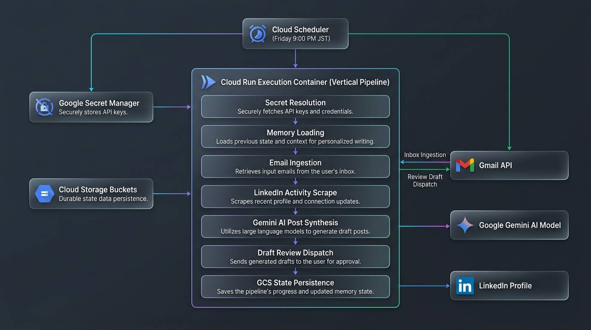
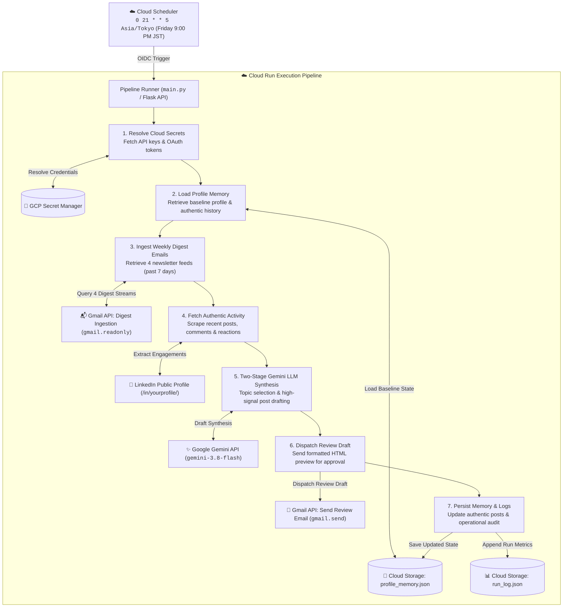

# LinkedIn Post Ghostwriter (Weekly Automated System)

An autonomous AI agent running on Google Cloud Run that executes every Friday at 9:00 PM JST. It ingests the past week's technical digests and email summaries from Gmail, retrieves the user's authentic LinkedIn profile and recent activity, and leverages Google Gemini to synthesize a concise, high-signal LinkedIn post. The draft is dispatched directly to Gmail for one-click review before publishing, while accumulating user profile memory and decoupled execution logs on Google Cloud Storage.

Designed with a **100% cloud-native, multi-PC portable architecture**: developers can clone and execute the system across any machine without copying local secret files or environment configurations.

---

## System Architecture



### Execution Flow & Service Integration



---

## Multi-PC Portability (Zero-Friction Cloud Configuration)

This repository is engineered to work seamlessly on any development machine without manually distributing `.env`, `credentials.json`, `token.json`, or local state files:

1. **GCP Secret Manager as Single Source of Truth**:
   - `gemini-api-key`: API key for Google Gemini generative models.
   - `gmail-agent-token`: OAuth 2.0 user access and refresh tokens for Gmail read/send scopes.
   - `gmail-oauth-credentials`: Desktop OAuth client credentials JSON (`client_id`, `client_secret`).
2. **Dual-Mode SDK & CLI Fallback**:
   - When running on Google Cloud Run, the application authenticates directly via Service Account Application Default Credentials (ADC).
   - When running locally on developer machines where ADC might be absent or expired, the system automatically falls back to invoking the active `gcloud` CLI session (`gcloud secrets versions access`) seamlessly across Windows, macOS, and Linux.
3. **On-Demand Local Token Cache**:
   - If an OAuth refresh is required locally, the client credentials JSON is automatically fetched into the OS temp directory (`tempfile.gettempdir()`), avoiding any uncommitted secret clutter in the workspace.
4. **Secret Synchronization Utility**:
   - Run `python -m src.sync_secrets` from any machine to upload or sync local credentials to Secret Manager in one step.

---

## State Persistence & Decoupled Run Logging (Google Cloud Storage)

System state is decoupled into two dedicated Google Cloud Storage blobs under `gs://$GCS_BUCKET_NAME/linkedin-ghostwriter/`:

### 1. `profile_memory.json` (Living Profile & Authentic LinkedIn Presence)
- **Baseline Profile**: Name, headline, professional summary, and core focus areas.
- **Authentic Post History**: Contains **only verified historical posts** published by the user on LinkedIn. AI-generated drafts are **never** committed here.
- **Recent Activities & Engagements**: Genuine reactions, comments, and shares scraped from LinkedIn to maintain contextual alignment with what the user has recently been engaging with.
- **Topic Blacklist**: Explicit list of excluded themes (unverified rumors, politics, generic platitudes).
- **Domain Insights**: Long-term accumulating themes and verified perspectives.

### 2. `run_log.json` (Decoupled Operational Audit & Suggested Topics)
- **Operational Runs**: Timestamped records of pipeline executions (status, duration, source message counts).
- **Suggested Topic History**: Rolling history of proposed draft topics and generated draft previews to prevent thematic repetition across consecutive weekly runs.

---

## Ingestion Sources & Gmail Search Queries

### Design Rationale: Gmail as the Ingestion Hub
In its current structure and configuration, this system **exclusively reads the user's Gmail inbox** for sourcing information. This design choice is deliberate:
- **Curated & Automated Upstream**: The user's Gmail inbox is kept clean, organized, and high-signal by independent upstream systems that continuously monitor websites, YouTube channels, and relevant tech news, automatically generating and delivering structured summaries and digests into Gmail.
- **Centralized Ingestion Point**: By relying on this already-aggregated and filtered inbox, the ghostwriter avoids redundant web scraping, polling multiple third-party APIs, or managing disparate feed credentials during its weekly execution.
- **Extensible Architecture**: Although Gmail serves as the sole ingestion hub in the present configuration, the codebase is modular. The system can be readily extended or customized to ingest information directly from other external sources (e.g., direct RSS feeds, YouTube APIs, web scrapers, Reddit/Hacker News APIs, or Slack/Discord channels) by adding new collector modules in `src/`.

### Configured Gmail Filter Streams
The pipeline queries Gmail across four distinct technical streams over a rolling lookback window (default: 7 days):

| Source | Origin / Stream | Gmail Filter Query | Extracted Content |
|---|---|---|---|
| **gmail-agent** | Internal Gmail summarizer | `("=== EMAIL SUMMARY ===" OR (from:me subject:Fwd:)) newer_than:7d` | Isolates `=== EMAIL SUMMARY ===` blocks, key discussion points, and action items |
| **AI News Digest** | `AI-news-aggregator-KRJP` | `subject:"Daily AI News Digest" newer_than:7d` | Regional East Asian AI policy, enterprise adoptions, and breakthrough announcements |
| **YouTube Digest** | `youtube-insight-digest` | `subject:"YouTube Intelligence Digest" newer_than:7d` | Technical video summaries, architectural teardowns, and engineering links |
| **ByteByteGo** | ByteByteGo Newsletter | `from:bytebytego@substack.com newer_than:7d` | System design, cloud scalability patterns, and distributed architecture insights |

### How to Customize the Sourcing Pipeline

The sourcing layer can be customized depending on whether your information lands in Gmail or needs to be fetched from external endpoints:

#### Option 1: Adding or Modifying Gmail Filter Streams (Zero New Infrastructure)
If new newsletters, summaries, or alerts already land in Gmail:
1. Open [`src/gmail_reader.py`](file:///src/gmail_reader.py) and navigate to `fetch_weekly_digests()`.
2. Add your stream identifier and Gmail query to the `queries` list:
   ```python
   queries = [
       ("email_summary", f'("=== EMAIL SUMMARY ===" OR (from:me subject:Fwd:)) newer_than:{days}d'),
       ("ai_news", f'subject:"Daily AI News Digest" newer_than:{days}d'),
       ("youtube_digest", f'subject:"YouTube Intelligence Digest" newer_than:{days}d'),
       ("bytebytego", f'from:bytebytego@substack.com newer_than:{days}d'),
       # Add your custom newsletter or alert stream:
       ("arxiv_digest", f'from:no-reply@arxiv.org subject:"cs.AI" newer_than:{days}d'),
       ("tech_radar", f'label:tech-radar newer_than:{days}d'),
   ]
   ```
3. Any standard Gmail search operator (`from:`, `subject:`, `label:`, `newer_than:`) is supported out of the box.
4. If your stream requires specialized excerpt extraction (similar to `=== EMAIL SUMMARY ===`), add a parsing condition in `fetch_message_details()`.

#### Option 2: Adding Direct External Connectors (RSS, REST APIs, Scrapers)
To pull information directly from third-party APIs or feeds without going through Gmail:
1. **Implement a Source Collector Module**:
   Create a new module in `src/` (e.g. `src/rss_reader.py`) that returns items adhering to the `EmailDigest` schema:
   ```python
   # src/rss_reader.py
   from src.gmail_reader import EmailDigest

   class RSSReader:
       def fetch_weekly_feed(self, url: str) -> list[EmailDigest]:
           # Fetch and parse feed items...
           return [
               EmailDigest(
                   source_type="rss_feed",
                   subject=entry.title,
                   sender=entry.author or "RSS Feed",
                   date_str=entry.published,
                   body_text=entry.summary,
                   summary_excerpt=entry.summary[:600],
                   links=[entry.link],
                   raw_id=entry.id,
               )
           ]
   ```
2. **Plug into the Pipeline Runner**:
   In [`src/main.py`](file:///src/main.py) inside `run_pipeline()`, instantiate your collector and append its results to the `digests` list before passing to Gemini:
   ```python
   from src.rss_reader import RSSReader

   # Fetch external sources and merge with Gmail digests
   external_items = RSSReader().fetch_weekly_feed("https://example.com/feed.xml")
   digests.extend(external_items)
   ```
3. **Log Metrics to Cloud Storage Audit**:
   Update `digest_stats` in [`src/main.py`](file:///src/main.py) so the new source counts are automatically persisted to `run_log.json` on Google Cloud Storage.

---

## Post Format & Ghostwriting Guidelines

Every post drafted by the system adheres strictly to the following criteria:

1. **Language**: English only.
2. **Length & Density**: Concise thought (approx. 800–1,200 characters). Zero fluff, clickbait, or buzzword soup.
3. **Opening Hook**: A single high-conviction or curiosity-piquing line engaging technical leaders and engineers.
4. **Core Insight**: 2 to 3 crisp paragraphs connecting recent technical activities to broader implications (enterprise AI, cloud architecture, system design, or international digital transformation).
5. **Engagement Question**: 1 thoughtful closing question designed to spark genuine peer discussion in the comments.
6. **Sources Block**: Dedicated `Sources:` section at the bottom citing specific articles, newsletters, and digests referenced.
7. **Hashtags**: Exactly 3 to 5 targeted tags (e.g., `#ArtificialIntelligence`, `#CloudArchitecture`, `#SystemDesign`).

---

## Project Structure

```
linkedin-post-ghostwriter/
├── .gcloudignore                # Google Cloud build exclusion rules
├── .gitignore                   # Git hygiene, local test & secret prevention
├── Dockerfile                   # Production Python 3.11 container image
├── requirements.txt             # Python dependencies
├── README.md                    # System documentation & architectural reference
├── deployment/
│   ├── deploy_cloud.ps1         # Cloud Run & Cloud Scheduler provisioning script
│   └── upload_token.ps1         # Secret Manager OAuth token sync script
└── src/
    ├── __init__.py              # Package marker
    ├── config.py                # Typed settings & dual-mode Secret Manager resolution
    ├── auth.py                  # Gmail OAuth 2.0 & multi-PC Secret Manager integration
    ├── gmail_reader.py          # 4-source weekly digest retrieval & parser
    ├── linkedin_scraper.py      # Authentic profile & activity scraper with cloud fallback
    ├── profile_memory.py        # Cloud Storage living profile memory manager
    ├── run_logger.py            # Decoupled GCS execution & suggested topic logger
    ├── post_drafter.py          # Gemini topic selector incorporating actual LinkedIn focus
    ├── email_sender.py          # HTML review email builder & Gmail dispatcher
    ├── sync_secrets.py          # Cloud Secret Manager synchronization utility
    ├── main.py                  # End-to-end pipeline orchestrator & CLI
    └── app.py                   # Flask serverless web endpoint (POST / & GET /)
```

> [!NOTE]
> In compliance with repository cleanliness standards, testing and debugging scripts are maintained externally and never committed to the project workspace.

---

## Configuration & Cloud Resolution

This system is engineered with a **Zero-Local-Secrets** architecture. All runtime configurations, credentials, living persona states, and execution logs are resolved directly from Google Cloud—eliminating the need to store local `.env` files or hardcode secrets on any machine:

| Parameter | Cloud Source / Resolution Strategy | Description | Default / Fallback |
|---|---|---|---|
| `GCP_PROJECT_ID` | Active `gcloud` context (`gcloud config get-value project`) | Google Cloud project identifier | Required via `gcloud` or parameter |
| `RECIPIENT_EMAIL` | Active `gcloud` account (`gcloud config get-value account`) | Target Gmail address for draft review | Auto-resolved from active login |
| `GEMINI_API_KEY` | GCP Secret Manager (`gemini-api-key`) | Google Gemini API key | Fetched securely on demand |
| `GMAIL_TOKEN` | GCP Secret Manager (`gmail-agent-token`) | Gmail OAuth 2.0 access & refresh tokens | Fetched securely on demand |
| `PROFILE_MEMORY` | GCS (`gs://<PROJECT_ID>-linkedin-memory/linkedin-ghostwriter/profile_memory.json`) | Author profile, background, expertise & past published posts | Loaded from Google Cloud Storage |
| `RUN_LOG` | GCS (`gs://<PROJECT_ID>-linkedin-memory/linkedin-ghostwriter/run_log.json`) | Audit history and suggested topics to avoid repetition | Updated in Google Cloud Storage |
| `GCP_REGION` | Deployment script / Cloud Run setting | Deployment and storage location | `asia-northeast1` |
| `GEMINI_MODEL` | Cloud Run environment / parameter | Gemini model version | `gemini-3.8-flash` |
| `TIMEZONE` | Cloud Scheduler setting | Execution and audit timestamp timezone | `Asia/Tokyo` |
| `SCHEDULE` | Cloud Scheduler job | Recurring pipeline execution cron | `0 21 * * 5` (Friday 9:00 PM JST) |

---

## 🚀 Quickstart: Deploying for Yourself

Follow these steps to set up and deploy your own automated LinkedIn post ghostwriter:

### 1. Prerequisites
- Python 3.11+
- A Google Cloud Platform account with billing enabled
- [Google Cloud SDK (`gcloud`)](https://cloud.google.com/sdk/docs/install) installed and authenticated
- A Gemini API key from [Google AI Studio](https://aistudio.google.com/)

### 2. Clone Repository & Install Dependencies
```powershell
git clone https://github.com/henryhyunwookim/linkedin-post-ghostwriter.git
cd linkedin-post-ghostwriter
pip install -r requirements.txt
```

### 3. Authenticate with Google Cloud & Enable APIs
Log in to your Google Cloud account, set your target project, and enable the required services:
```powershell
gcloud auth login
gcloud config set project <your-gcp-project-id>

gcloud services enable `
    run.googleapis.com `
    cloudbuild.googleapis.com `
    artifactregistry.googleapis.com `
    cloudscheduler.googleapis.com `
    secretmanager.googleapis.com `
    storage.googleapis.com
```

### 4. Set Up Gmail OAuth Credentials
1. Open the [Google Cloud Console Credentials Page](https://console.cloud.google.com/apis/credentials).
2. Click **Create Credentials** > **OAuth client ID**.
3. Select **Desktop app** as the Application type, give it a descriptive name (e.g. `LinkedIn Ghostwriter Local`), and click **Create**.
4. Download the client secret JSON file and save it as `credentials.json` in the root directory of this repository (`credentials.json` is protected by `.gitignore` and will never be committed).
5. In **Google Cloud Console** > **APIs & Services** > **OAuth consent screen**, add your Gmail address under **Test users**.

### 5. Authorize Gmail Access
Run the authentication script to generate your local OAuth token:
```powershell
python -m src.auth
```
A browser window will prompt you to log in with your Google account and grant the `gmail.readonly` and `gmail.send` scopes. Once authorized, `token.json` is created locally.

### 6. Sync Gemini API Key & Secrets to Cloud Secret Manager
Upload your Gemini API key and credentials to Google Cloud Secret Manager so the system can run without local secret files:
```powershell
# Set your Gemini API key in Secret Manager
$key = Read-Host "Enter your Gemini API Key" -AsSecureString
$bstr = [System.Runtime.InteropServices.Marshal]::SecureStringToBSTR($key)
$plainKey = [System.Runtime.InteropServices.Marshal]::PtrToStringAuto($bstr)
$plainKey | gcloud secrets create gemini-api-key --data-file=- --project=<your-gcp-project-id> --replication-policy="automatic"

# Sync credentials to Secret Manager
python -m src.sync_secrets
```

### 7. Test Locally (Dry-Run Preview)
Verify the complete pipeline locally without sending an email or mutating Cloud Storage:
```powershell
python -m src.main --dry-run
```
The pipeline automatically pulls your `gemini-api-key` and `gmail-agent-token` from Secret Manager, reads recent email digests from Gmail, and outputs the generated post directly into your terminal.

To dispatch an actual draft preview email to your Gmail:
```powershell
python -m src.main
```

### 8. Deploy to Google Cloud Run
Deploy the container and automated weekly Cloud Scheduler trigger:
```powershell
.\deployment\deploy_cloud.ps1
```
This script will:
- Create the Cloud Storage bucket for persistent profile memory and execution logs.
- Build and deploy the container service to Google Cloud Run.
- Create a dedicated IAM Service Account with invocation permissions.
- Configure a Cloud Scheduler job triggering the pipeline every Friday at 9:00 PM JST.

### 9. Upload OAuth Token to Cloud Secret Manager
Ensure Cloud Run has access to the authorized Gmail token:
```powershell
.\deployment\upload_token.ps1
```
Your ghostwriter is now fully operational in the cloud with zero local secrets required!

---

## License

This project is licensed under the [MIT License](LICENSE).
