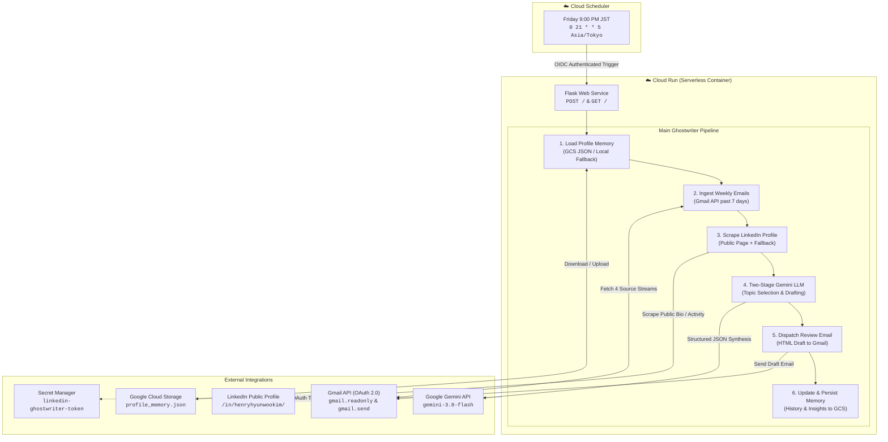

# LinkedIn Post Ghostwriter (Weekly Automated System)

An autonomous AI agent running on Google Cloud Run that executes every Friday at 9:00 PM JST. It ingests the past week's technical digests and email summaries from Gmail, scrapes the user's public LinkedIn profile, and leverages Google Gemini to synthesize a concise, high-signal LinkedIn post. The draft is dispatched directly to Gmail for one-click review before publishing, while accumulating user profile memory and topic histories on Google Cloud Storage.

---

## System Architecture



---

## Key Ingestion Sources & Exact Filters

The pipeline queries Gmail across four distinct technical streams over a rolling lookback window (default: 7 days):

| Source | Origin / Generator | Exact Gmail Filter Query | Extraction Logic |
|---|---|---|---|
| **gmail-agent** | Internal Gmail summarizer | `("=== EMAIL SUMMARY ===" OR (from:me subject:Fwd:)) newer_than:7d` | Isolates the `=== EMAIL SUMMARY ===` block and action items |
| **AI News Digest** | `AI-news-aggregator-KRJP` | `subject:"Daily AI News Digest" newer_than:7d` | Extracts regional Korean & Japanese AI initiatives and policy shifts |
| **YouTube Digest** | `youtube-insight-digest` | `subject:"YouTube Intelligence Digest" newer_than:7d` | Extracts video summaries, architectural takeaways, and key links |
| **ByteByteGo** | ByteByteGo Newsletter | `from:bytebytego@substack.com newer_than:7d` | Extracts system design, scalability, and distributed systems insights |

---

## Post Format & Ghostwriting Guidelines

Every post drafted by the system strictly follows these structural rules:
1. **Language**: English only.
2. **Length & Density**: Concise thought (approx. 800–1,200 characters). Zero fluff, clickbait, or buzzword soup.
3. **Opening Hook**: A single high-conviction or curiosity-piquing line engaging technical leaders.
4. **Core Insight**: 2 to 3 crisp paragraphs connecting recent technical activities to broader implications (enterprise AI, cloud scaling, digital capacity, or international development).
5. **Engagement Question**: 1 thoughtful closing question that sparks peer discussion.
6. **Sources Section**: Dedicated `Sources:` block at the bottom referencing specific articles, newsletters, and digests used.
7. **Hashtags**: Exactly 3 to 5 targeted tags (e.g., `#ArtificialIntelligence`, `#CloudArchitecture`, `#SystemDesign`).

---

## Profile Memory Persistence (Cloud Storage)

The system maintains a living profile memory file (`profile_memory.json`) in Google Cloud Storage:
- **Baseline Profile**: Name, headline, summary, and core expertise areas.
- **Post History**: Running list of past post topics, dates, and drafts to guarantee topic diversity and prevent duplicate themes across weeks.
- **Topic Blacklist**: Explicit list of excluded themes (e.g. unverified rumors, politics, generic platitudes).
- **Accumulated Insights**: Key historical takeaways preserved over time.
- **Run Audit Log**: Timestamped execution records and chosen topics.

---

## Project Structure

```
linkedin-post-ghostwriter/
├── .env.example                 # Environment variables specification
├── .gcloudignore                # Google Cloud build exclusion rules
├── .gitignore                   # Git hygiene & secret prevention
├── Dockerfile                   # Production Python 3.11 container image
├── requirements.txt             # Python dependencies
├── README.md                    # System documentation & architectural reference
├── deployment/
│   ├── deploy_cloud.ps1         # Cloud Run & Cloud Scheduler provisioning script
│   └── upload_token.ps1         # Secret Manager OAuth token sync script
├── src/
│   ├── __init__.py              # Package marker
│   ├── config.py                # Typed settings & environment loader
│   ├── auth.py                  # Gmail OAuth 2.0 & Secret Manager integration
│   ├── gmail_reader.py          # 4-source weekly digest retrieval & parser
│   ├── linkedin_scraper.py      # Public profile scraper with graceful fallback
│   ├── profile_memory.py        # Cloud Storage / local JSON memory manager
│   ├── post_drafter.py          # Two-stage Gemini topic selector & post ghostwriter
│   ├── email_sender.py          # HTML review email builder & Gmail dispatcher
│   ├── main.py                  # End-to-end pipeline orchestrator & CLI
│   └── app.py                   # Flask serverless web endpoint (POST / & GET /)
└── tests/
    ├── test_gmail_reader.py     # Unit tests for text parsing & summary extraction
    └── test_profile_memory.py   # Unit tests for memory persistence & history tracking
```

---

## Configuration & Environment Variables

Create a `.env` file in the root directory based on [.env.example](file:///.env.example):

| Variable | Description | Default / Example |
|---|---|---|
| `GEMINI_API_KEY` | Google Gemini API key from AI Studio | Required |
| `GEMINI_MODEL` | Gemini generative model | `gemini-3.8-flash` |
| `RECIPIENT_EMAIL` | Target Gmail address for draft review | `your_email@gmail.com` |
| `RECIPIENT_NAME` | Display name for draft email header | `Henry` |
| `LINKEDIN_PROFILE_URL` | Public profile URL | `https://www.linkedin.com/in/henryhyunwookim/` |
| `TIMEZONE` | Execution and date timezone | `Asia/Tokyo` |
| `SCHEDULE` | Cloud Scheduler cron schedule | `0 21 * * 5` (Friday 9PM JST) |
| `GCP_PROJECT_ID` | Google Cloud project identifier | `gen-lang-client-0480639565` |
| `GCP_REGION` | Cloud Run and Storage region | `asia-northeast1` |
| `SERVICE_NAME` | Cloud Run service name | `linkedin-post-ghostwriter` |
| `JOB_NAME` | Cloud Scheduler job name | `linkedin-ghostwriter-weekly-trigger` |
| `GCS_BUCKET_NAME` | Bucket for persistent memory | `gen-lang-client-0480639565-linkedin-memory` |
| `SECRET_NAME` | Secret Manager secret for Gmail OAuth token | `linkedin-ghostwriter-token` |

---

## Local Development & Testing

### 1. Prerequisites
- Python 3.11+ (or `py -3.11`)
- Google Cloud SDK (`gcloud`)
- Valid `credentials.json` in the root directory (downloaded from GCP OAuth Client ID)

### 2. Interactive Gmail Authentication
Run the interactive auth tool to generate a local `token.json`:
```powershell
py -3.11 -m src.auth
```
Follow the browser prompt to authorize `gmail.readonly`, `gmail.send`, and `gmail.modify` scopes.

### 3. Run Unit Tests
```powershell
py -3.11 -m unittest discover -s tests -v
```

### 4. Dry Run Execution (Preview Only)
Preview the ingested digests, LinkedIn profile scrape, and generated post draft in your terminal without sending emails or modifying GCS:
```powershell
py -3.11 -m src.main --dry-run
```

### 5. Live Test Execution
Trigger an immediate full pipeline execution that sends the draft review email to your Gmail:
```powershell
py -3.11 -m src.main
```

---

## Cloud Deployment (Google Cloud Run)

> [!IMPORTANT]
> In accordance with deployment policy, cloud infrastructure is never automatically deployed. Review the steps below and execute with explicit approval.

### 1. Upload OAuth Token to Secret Manager
Upload your authenticated `token.json` to Google Cloud Secret Manager so Cloud Run can access Gmail headlessly:
```powershell
.\deployment\upload_token.ps1
```

### 2. Deploy Cloud Run & Cloud Scheduler
Execute the deployment script to build the container, provision the GCS memory bucket, deploy to Cloud Run, and set up the Friday 9:00 PM JST Cloud Scheduler trigger:
```powershell
.\deployment\deploy_cloud.ps1
```

---

## License

Private repository. All rights reserved.
